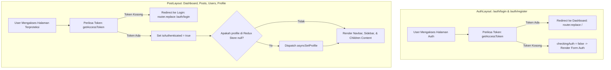
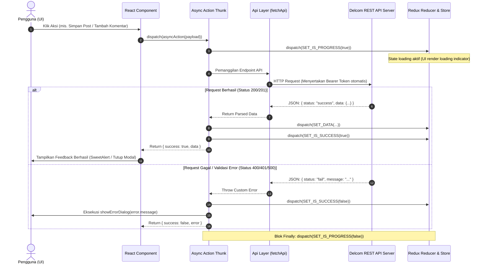
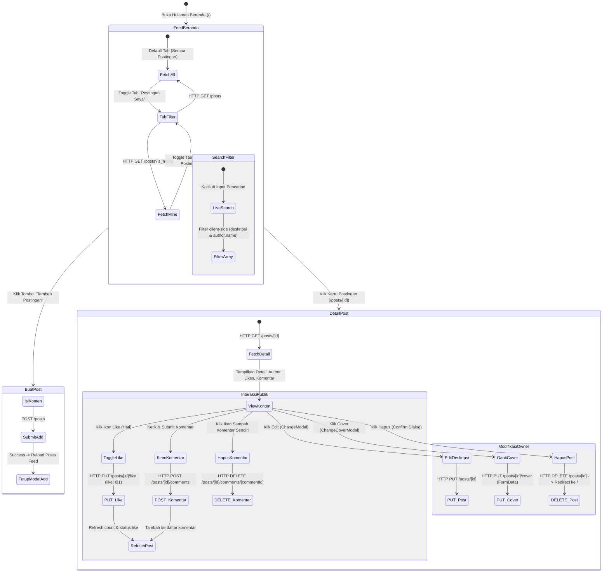
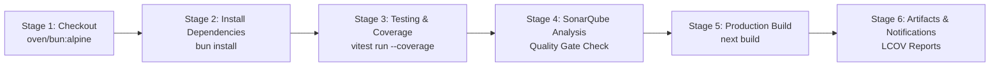

# Analisis Komprehensif Arsitektur & Alur Logika Aplikasi
## Platform Komunitas & Postingan Delcom (`ifs24036-pabwe2026-nextjs`)

---

## Daftar Isi
1. [Ringkasan Eksekutif (Executive Summary)](#1-ringkasan-eksekutif-executive-summary)
2. [Arsitektur Sistem & Struktur Direktori](#2-arsitektur-sistem--struktur-direktori)
   - 2.1 [Rasional & Argumen Feature-Driven Modular Architecture](#21-rasional--argumen-feature-driven-modular-architecture)
   - 2.2 [Peta Dekomposisi Direktori](#22-peta-dekomposisi-direktori)
3. [Alur Logika Inti & Siklus Hidup Data (Core Logic Flow)](#3-alur-logika-inti--siklus-hidup-data-core-logic-flow)
   - 3.1 [Siklus Bootstrapping & Server Initialization (`server.ts`)](#31-siklus-bootstrapping--server-initialization-serverts)
   - 3.2 [Mekanisme Client-Side Authentication Guarding (`AuthLayout` & `PostLayout`)](#32-mekanisme-client-side-authentication-guarding-authlayout--postlayout)
   - 3.3 [Siklus Manajemen State Terpadu (Redux Toolkit Data Lifecycle)](#33-siklus-manajemen-state-terpadu-redux-toolkit-data-lifecycle)
   - 3.4 [Alur Logika Autentikasi Pengguna (`features/auth`)](#34-alur-logika-autentikasi-pengguna-featuresauth)
   - 3.5 [Alur Logika Manajemen Konten Postingan (`features/posts`)](#35-alur-logika-manajemen-konten-postingan-featuresposts)
   - 3.6 [Alur Logika Profil & Direktori Pengguna (`features/users`)](#36-alur-logika-profil--direktori-pengguna-featuresusers)
4. [Kedalaman Analisis Teknis (Deep Technical Analysis)](#4-kedalaman-analisis-teknis-deep-technical-analysis)
   - 4.1 [Abstraksi Jaringan & Lapisan API (`apiHelper.ts`)](#41-abstraksi-jaringan--lapisan-api-apihelperts)
   - 4.2 [Immutability, State Normalization & Re-rendering Prevention](#42-immutability-state-normalization--re-rendering-prevention)
   - 4.3 [User Feedback Loop & Dialog Interaktif (`toolsHelper.ts`)](#43-user-feedback-loop--dialog-interaktif-toolshelperts)
   - 4.4 [Evaluasi & Analisis Keamanan (Security Posture)](#44-evaluasi--analisis-keamanan-security-posture)
5. [Strategi Pengujian (Testing Strategy) & CI/CD Pipeline](#5-strategi-pengujian-testing-strategy--cicd-pipeline)
   - 5.1 [Kebijakan 100% Code Coverage (Vitest)](#51-kebijakan-100-code-coverage-vitest)
   - 5.2 [Analisis Pipeline Jenkins & Integrasi SonarQube](#52-analisis-pipeline-jenkins--integrasi-sonarqube)
6. [Matriks Komponen, Aksi, dan Endpoint](#6-matriks-komponen-aksi-dan-endpoint)
7. [Rekomendasi Skalabilitas & Rencana Masa Depan](#7-rekomendasi-skalabilitas--rencana-masa-depan)

---

## 1. Ringkasan Eksekutif (Executive Summary)

Aplikasi **Delcom Posts** (`ifs24036-pabwe2026-nextjs`) adalah aplikasi web modern berbasis **Next.js 16 (App Router)** dan **React 19**, dieksekusi di atas runtime **Bun**. Aplikasi ini dirancang sebagai platform jejaring sosial mikro yang memungkinkan pengguna:
1. Melakukan registrasi, login, dan autentikasi berbasis Bearer Token (JWT).
2. Membaca feed komunitas, memfilter postingan ("Semua Postingan" vs "Postingan Saya"), dan mencari konten secara interaktif.
3. Melakukan manipulasi konten (CRUD Postingan), termasuk upload foto sampul (*cover*) berformat multipart.
4. Melakukan interaksi sosial seperti pemberian *Like/Unlike* dan penambahan serta penghapusan komentar secara instan.
5. Menjelajahi direktori sesama pengguna dan memperbarui profil pribadi (nama, email, avatar foto, dan pergantian password).

Sistem dibangun dengan standar keandalan *enterprise-grade*, di mana setiap modul unit diuji dengan target ketat **100% Code Coverage** (Statements, Branches, Functions, Lines) dan diintegrasikan ke dalam pipeline CI/CD Jenkins serta analisis kualitas kode SonarQube.

---

## 2. Arsitektur Sistem & Struktur Direktori

### 2.1 Rasional & Argumen Feature-Driven Modular Architecture

Dalam pengembangan perangkat lunak frontend berskala menengah hingga besar, pola pengorganisasian berbasis lapisan teknis konvensional (misalnya menaruh seluruh komponen di `/components`, seluruh action di `/actions`, dan seluruh halaman di `/pages`) kerap menimbulkan masalah **keterkaitan erat (tight coupling)** dan **kelelahan navigasi (navigational fatigue)** saat codebase berkembang.

Repositori ini mengadopsi pola **Feature-Driven Modular Architecture (Domain-Driven Frontend)** dengan dasar argumen berikut:

1. **Kohesi Tinggi & Kopling Rendah (High Cohesion, Low Coupling)**:
   Setiap domain fitur (`auth`, `posts`, `users`) merangkum sendiri seluruh kebutuhannya:
   - Kontrak API (`api/`)
   - Presentasi visual (`components/`, `modals/`, `layouts/`, `pages/`)
   - Manajemen *state* terisolasi (`states/action.ts`, `states/reducer.ts`)
   - Skrip pengujian otomatis unit dan integrasi (`*.test.ts`, `*.test.tsx`)
2. **Keterbacaan & Portabilitas**:
   Pengembang yang ingin memodifikasi atau memperbaiki fitur Postingan hanya perlu bekerja di lingkup folder `src/features/posts/` tanpa perlu khawatir merusak fitur Autentikasi atau Profil Pengguna.
3. **Pemisahan Jelas antara Routing dan Logika Bisnis**:
   Folder `src/app/` hanya bertindak sebagai *thin route shell* (lapisan deklarasi routing Next.js App Router). Komponen halaman di `src/app/` hanya mengimpor dan me-render *feature container page* dari `src/features/`.

### 2.2 Peta Dekomposisi Direktori

```
src/
├── app/                               # Next.js 16 App Router (Declarative Shell Layer)
│   ├── (dashboard)/                   # Route group terautentikasi
│   │   ├── layout.tsx                 # Menggunakan PostLayout (Auth Guard Dashboard)
│   │   ├── page.tsx                   # Route: / -> HomePage
│   │   ├── posts/[postId]/page.tsx    # Route: /posts/[postId] -> DetailPage
│   │   ├── profile/page.tsx           # Route: /profile -> ProfilePage
│   │   └── users/page.tsx             # Route: /users -> UsersPage
│   ├── auth/                          # Route group publik/autentikasi
│   │   ├── layout.tsx                 # Menggunakan AuthLayout (Guest Guard)
│   │   ├── login/page.tsx             # Route: /auth/login -> LoginPage
│   │   └── register/page.tsx          # Route: /auth/register -> RegisterPage
│   ├── globals.css                    # Tailwind CSS v4 directives & custom tokens
│   └── layout.tsx                     # Root Layout: Provider Redux, Typography, Metadata
│
├── components/                        # Shared cross-cutting components
│   └── Providers.tsx                  # Redux Store Provider wrapper
│
├── features/                          # Domain Features (Core Business Logic)
│   ├── auth/                          # Domain Autentikasi
│   │   ├── api/                       # Endpoint abstraction (authApi)
│   │   ├── layouts/                   # AuthLayout (Visual banner + Guard)
│   │   ├── pages/                     # LoginPage, RegisterPage
│   │   └── states/                    # Action types, thunks, reducers
│   ├── posts/                         # Domain Postingan & Interaksi Sosial
│   │   ├── api/                       # Endpoint abstraction (postApi)
│   │   ├── components/                # NavbarComponent, SidebarComponent
│   │   ├── layouts/                   # PostLayout (Sidebar, Navbar, Session Guard)
│   │   ├── modals/                    # AddModal, ChangeModal, ChangeCoverModal
│   │   ├── pages/                     # HomePage, DetailPage
│   │   └── states/                    # Action types, thunks, reducers
│   └── users/                         # Domain Pengguna & Profil
│       ├── api/                       # Endpoint abstraction (userApi)
│       ├── pages/                     # ProfilePage, UsersPage
│       └── states/                    # Action types, thunks, reducers
│
├── helpers/                           # Utility & Adapter Layer
│   ├── apiHelper.ts                   # Fetch wrapper, Token injector, Error parser
│   └── toolsHelper.ts                 # SweetAlert2 wrappers & Date formatters
│
├── hooks/                             # Custom React Hooks
│   ├── redux.ts                       # Typed useDispatch & useSelector hooks
│   └── useInput.ts                    # Form input controller hook
│
├── lib/                               # Static configuration & environment variables
│   └── config.ts                      # DELCOM_BASEURL configuration
│
├── types/                             # Centralized TypeScript Contract Definitions
│   ├── action.ts                      # Action payloads & interfaces
│   └── index.ts                       # Domain Entities (User, Post, Comment, ApiResult)
│
├── server.ts                          # Custom CLI/Port Bootstrapper
└── store.ts                           # Centralized Redux Store Configuration
```

---

## 3. Alur Logika Inti & Siklus Hidup Data (Core Logic Flow)

### 3.1 Siklus Bootstrapping & Server Initialization (`server.ts`)

Aplikasi menyediakan lapisan bootstrapper kustom pada `src/server.ts` yang dijalankan melalui script runtime Bun (`bun src/server.ts dev` atau `bun src/server.ts start`).

```mermaid
flowchart TD
    Start([Eksekusi: bun src/server.ts [dev|start]]) --> ReadPort{Cek Port}
    ReadPort -->|Ada process.env.APP_PORT| UseEnvPort[Gunakan APP_PORT]
    ReadPort -->|Cek file .env| UseDotEnv[Ambil nilai APP_PORT dari .env]
    ReadPort -->|Cek file .env.example| UseDotEnvExample[Ambil nilai APP_PORT dari .env.example]
    ReadPort -->|Semua Kosong| FallbackPort[Fallback ke Port 3000]
    
    UseEnvPort --> SpawnProcess[Spawn Next.js CLI: node_modules/next/dist/bin/next]
    UseDotEnv --> SpawnProcess
    UseDotEnvExample --> SpawnProcess
    FallbackPort --> SpawnProcess

    SpawnProcess --> ForwardEnv[Inject PORT & APP_PORT ke Environment Child Process]
    ForwardEnv --> StreamStdio[stdio: inherit & Bind Exit Handler]
    StreamStdio --> NextRunning([Next.js App Server Aktif])
```

#### Argumen Rasional Desain:
Mengapa menggunakan `server.ts` alih-alih `next dev` langsung?
- **Independensi Lingkungan Kontainer & CI/CD**: Di lingkungan Jenkins atau Docker, port aplikasi sering dialokasikan secara dinamis melalui file konfigurasi `.env` tanpa perlu mengubah skrip npm di `package.json`.
- **Eksekusi Port Presisi**: Menghindari konflik port jika beberapa instance pipeline dijalankan bersamaan pada server pembangun yang sama.

---

### 3.2 Mekanisme Client-Side Authentication Guarding (`AuthLayout` & `PostLayout`)

Keamanan navigasi halaman dikelola melalui dua *layout guard* di sisi klien:



#### Analisis Kedalaman Mekanisme Guarding:
1. **Pencegahan Hydration Mismatch & Screen Flashing**:
   Kedua layout menginisialisasi status verifikasi (`checkingAuth = true` di `AuthLayout` dan `isAuthenticated = null` di `PostLayout`). Selama proses pemeriksaan token lokal berlangsung, layar menampilkan *accessible spinner* berstandar WAI-ARIA (`<output aria-label="...">` atau `data-testid="post-layout-loading"`), memastikan konten terproteksi tidak pernah bocor ke DOM sebelum sesi terverifikasi.
2. **Pemuatan Profil Otomatis (Eager Fetching)**:
   Saat `PostLayout` mendeteksi token yang valid namun data `profile` di Redux belum tersedia (misalnya akibat *refresh browser*), layout secara otomatis men-dispatch `asyncSetProfile()`. Hal ini menjamin seluruh komponen anak (`children`) di dalam dasbor dapat mengakses identitas pengguna aktif secara konsisten.

---

### 3.3 Siklus Manajemen State Terpadu (Redux Toolkit Data Lifecycle)

Arsitektur state aplikasi memisahkan antara **Data State**, **Operation Progress State** (loading), dan **Operation Status State** (sukses/gagal).



#### Argumen Rasional Pemisahan Reducer Granular:
Di dalam `store.ts`, aplikasi mendaftarkan *slice reducers* berbutir halus (*fine-grained reducers*):
- `posts`: Menyimpan daftar array seluruh postingan aktif.
- `post`: Menyimpan data tunggal postingan detail yang sedang dibuka.
- `isPostAdd`, `isPostAdded`: Menandai status progres dan hasil pembuatan postingan baru.
- `isPostChange`, `isPostChanged`: Menandai status pembaruan konten postingan.
- `isPostDelete`, `isPostDeleted`: Menandai status penghapusan postingan.

**Mengapa tidak menggabungkan seluruh status ini dalam satu objek raksasa?**
Pemisahan granular ini mencegah *unnecessary re-renders* pada komponen yang tidak berkepentingan. Sebuah modal penambahan postingan hanya berlangganan pada `state.isPostAdd`, sehingga mutasi pada daftar `posts` di latar belakang tidak memicu re-render berlebihan pada form input modal.

---

### 3.4 Alur Logika Autentikasi Pengguna (`features/auth`)

```mermaid
flowchart TD
    subgraph FlowLogin [Alur Login]
        L1[Pengguna Mengisi Email & Password] --> L2{Validasi Input Sisi Klien}
        L2 -->|Kosong| L3[Tampilkan Alert: Form wajib diisi]
        L2 -->|Valid| L4[Dispatch asyncSetAuthLogin]
        L4 --> L5[HTTP POST /auth/login]
        L5 -->|Gagal| L6[showErrorDialog & Reset Status Login]
        L5 -->|Sukses| L7[Simpan JWT ke localStorage: putAccessToken]
        L7 --> L8[Set isAuthLogin = true]
        L8 --> L9[Redirect ke Halaman Utama /]
    end

    subgraph FlowRegister [Alur Registrasi]
        R1[Pengguna Mengisi Nama, Email, Password] --> R2{Validasi Klien & Konfirmasi Sandi}
        R2 -->|Tidak Cocok/Kosong| R3[Tampilkan Alert Validasi]
        R2 -->|Valid| R4[Dispatch asyncSetAuthRegister]
        R4 --> R5[HTTP POST /auth/register]
        R5 -->|Gagal| R6[showErrorDialog & Rollback Status]
        R5 -->|Sukses| R7[Set isAuthRegister = true]
        R7 --> R8[showSuccessDialog: Akun berhasil dibuat]
        R8 --> R9[Redirect ke /auth/login]
    end

    subgraph FlowLogout [Alur Logout]
        O1[Pengguna Klik Tombol Keluar] --> O2[Tampilkan showConfirmDialog]
        O2 -->|Batal| O3[Tetap di Halaman]
        O2 -->|Konfirmasi| O4[Dispatch asyncSetAuthLogout]
        O4 --> O5[HTTP POST /auth/logout API]
        O5 --> O6[Blok Finally: removeAccessToken dari localStorage]
        O6 --> O7[Set isAuthLogout = true]
        O7 --> O8[Redirect ke /auth/login]
    end
```



---

### 3.5 Alur Logika Manajemen Konten Postingan (`features/posts`)

Fitur postingan mencakup spektrum interaksi terluas dalam aplikasi:



#### Analisis Alur Khusus:
1. **Otorisasi Berbasis Kepemilikan (Ownership Guarding)**:
   Pada `DetailPage.tsx`, aplikasi memeriksa kecocokan identitas:
   ```typescript
   const isOwner = profile && post && post.user_id === profile.id;
   ```
   Tombol edit teks, ubah foto sampul, dan hapus postingan hanya akan di-render jika `isOwner === true`.
2. **Pemberian Like Dinamis (Idempotent Toggle)**:
   Pengecekan like menggunakan lookup array: `post.likes.includes(profile.id)`. Jika ID pengguna sudah terdaftar, aksi like mengirimkan payload `{ id, like: 0 }` (unlike); jika belum terdaftar, mengirimkan `{ id, like: 1 }` (like). Setelah aksi selesai, post detail di-fetch ulang untuk menjaga sinkronisasi status like dengan database server.
3. **Pembersihan Massal (Batch Delete)**:
   Di `HomePage.tsx`, jika pengguna berada pada tab "Postingan Saya", disediakan opsi destruktif *Hapus Semua Postingan* via `asyncSetPostDeleteAll()`. Aksi ini dilindungi oleh konfirmasi ganda SweetAlert2 untuk mencegah kehilangan data tidak disengaja.

---

### 3.6 Alur Logika Profil & Direktori Pengguna (`features/users`)

```mermaid
flowchart LR
    subgraph DirektoriPengguna [Direktori Pengguna: /users]
        U1[Akses Halaman Users] --> U2[Dispatch asyncSetUsers]
        U2 --> U3[GET /users]
        U3 --> U4[Tampilkan Grid Kartu Pengguna]
        U4 --> U5[Live Search: Filter nama & email di sisi klien]
    end

    subgraph ManajemenProfil [Halaman Profil: /profile]
        P1[Akses Halaman Profil] --> P2[Dispatch asyncSetProfile jika state kosong]
        
        P2 --> FormBio[Form 1: Ubah Data Diri]
        FormBio --> P_Bio[PUT /users -> asyncSetChangeProfile]
        
        P2 --> FormFoto[Form 2: Unggah Avatar Baru]
        FormFoto --> P_Foto[PUT /users/photo (FormData) -> asyncSetChangeProfilePhoto]
        
        P2 --> FormSandi[Form 3: Ganti Kata Sandi]
        FormSandi --> ValidSandi{Sandi Baru == Konfirmasi Sandi?}
        ValidSandi -->|Tidak| ErrSandi[Tampilkan Error Dialog]
        ValidSandi -->|Ya| P_Sandi[PUT /users/password -> asyncSetChangeProfilePassword]
    end
```

---

## 4. Kedalaman Analisis Teknis (Deep Technical Analysis)

### 4.1 Abstraksi Jaringan & Lapisan API (`apiHelper.ts`)

Modul `src/helpers/apiHelper.ts` merupakan jantung komunikasi HTTP aplikasi. Fungsi `fetchApi<T>` dirancang membungkus standar native `fetch` dengan beberapa argumen rekayasa penting:

```typescript
export async function fetchApi<T = unknown>(
  endpoint: string,
  options: FetchApiOptions = {}
): Promise<T> { ... }
```

#### 1. Smart Query Parameter Serializer
Opsi `params` menerima *dictionary* objek dan secara otomatis merangkainya menjadi *querystring* standar melalui `URLSearchParams`. Nilai bertipe `undefined` atau `null` dieliminasi secara ketat untuk mencegah terkirimnya parameter seperti `?is_me=undefined` ke server.

#### 2. Automatic Authorization Injection
Secara transparan mengambil token aktif dari `localStorage` via `getAccessToken()`. Jika token ditemukan dan pemanggil tidak mendefinisikan header `Authorization` manual, fungsi akan menyisipkan header:
```
Authorization: Bearer <token>
```

#### 3. Automatic JSON vs. Multipart Content-Type Handling
Salah satu bug paling umum pada aplikasi web adalah menimpa header `Content-Type: application/json` saat mengirimkan `FormData` (misalnya saat upload gambar). Hal ini merusak *boundary delimiter* biner HTTP.
`apiHelper.ts` mengatasi hal ini dengan pengecekan bertingkat:
```typescript
if (
  restOptions.body &&
  !(restOptions.body instanceof FormData) &&
  !headers.has("Content-Type")
) {
  headers.set("Content-Type", "application/json");
}
```
Jika `body` merupakan instansiasi `FormData`, `apiHelper` membiarkan browser menentukan header `Content-Type: multipart/form-data; boundary=----WebKitFormBoundary...` secara otomatis.

#### 4. Unified Error Handling & Flattener
Backend Delcom mengembalikan status respons dalam konvensi JSend (`fail` atau `error`). Struktur error validasi server sering berupa array objek: `{ data: { email: ["Format email salah"] } }`.
`apiHelper.ts` mendeteksi kondisi:
```typescript
if (!response.ok || data.status === "fail" || data.status === "error") {
  const errorMessage =
    data.message ||
    (data.data && typeof data.data === "object"
      ? Object.values(data.data).flat().join(", ")
      : "Terjadi kesalahan pada server");
  const error = new Error(errorMessage);
  (error as unknown as { response: unknown }).response = data;
  throw error;
}
```
Hasilnya: Pesan validasi bersarang (*nested error array*) otomatis diratakan (*flattened*) menjadi string tunggal yang ramah pengguna saat disajikan ke komponen visual.

---

### 4.2 Immutability, State Normalization & Re-rendering Prevention

Dalam aplikasi SPA/Next.js interaktif, konsistensi data bergantung pada kepatuhan terhadap prinsip *state immutability*:

1. **State Reducer Murni**:
   Seluruh reducer di `src/features/*/states/reducer.ts` diimplementasikan sebagai fungsi murni (*pure functions*). Setiap perubahan data mengembalikan referensi baru (*new object reference*) atau nilai primitif baru, memastikan sistem reaktivitas React 19 dapat mendeteksi mutasi dan memicu render ulang secara tepat.
2. **Komposisi Hook Kustom `useInput`**:
   Untuk form sederhana pada autentikasi, `useInput` menyediakan handler dua arah (*two-way binding*) yang terisolasi di tingkat komponen lokal. Pengisian karakter pada form tidak pernah mencemari Redux store global hingga pengguna menekan tombol *Submit*. Hal ini meminimalkan overhead rendering pada pohon komponen root.
3. **Pemisahan State Remote vs. State Efemeral**:
   - Data persisten dari server (Post, Profile, Daftar Users) disimpan dalam Redux store.
   - Status modal terbuka/tertutup (`isOpen`), teks input sementara, dan pratinjau gambar (*image preview URL*) disimpan dalam local React `useState`.

---

### 4.3 User Feedback Loop & Dialog Interaktif (`toolsHelper.ts`)

Aplikasi mengisolasi seluruh interaksi popup dan dialog sistem ke dalam `src/helpers/toolsHelper.ts` dengan memanfaatkan pustaka **SweetAlert2**:
- `showSuccessDialog(title, text)`: Dialog notifikasi sukses berwarna hijau/biru.
- `showErrorDialog(title, text)`: Dialog notifikasi kegagalan berwarna merah dengan penjelasan error.
- `showConfirmDialog(title, text, confirmButtonText)`: Dialog interaktif modal pemblokir (*blocking modal*) yang mengembalikan nilai boolean (`true` jika disetujui, `false` jika dibatalkan).

#### Rasional:
- Menggantikan fungsi bawaan peramban (`window.alert`, `window.confirm`) yang memblokir *thread* JavaScript utama peramban dan tidak dapat disesuaikan secara visual.
- Membantu menciptakan pengalaman pengguna (UX) yang seragam di seluruh resolusi layar (desktop, tablet, mobile).

---

### 4.4 Evaluasi & Analisis Keamanan (Security Posture)

| Vektor Keamanan | Implementasi Saat Ini | Evaluasi Risiko & Solusi Berjalan |
| :--- | :--- | :--- |
| **Penyimpanan Token** | JWT disimpan dalam `localStorage` (`DELCOM_TOKEN`). | **Risiko**: Rentan terhadap serangan Cross-Site Scripting (XSS) jika ada skrip pihak ketiga yang disusupkan.<br>**Solusi Eksisting**: Aplikasi bebas dari injeksi HTML mentah (`dangerouslySetInnerHTML` tidak digunakan sama sekali di codebase). |
| **Pemeriksaan Sesi** | Pengecekan token di `useEffect` via `getAccessToken()`. | **Risiko**: Verifikasi di sisi klien masih memungkinkan flash konten jika tidak dijaga.<br>**Solusi Eksisting**: Layout menampilkan state loading spinner eksklusif sebelum status otentikasi diputuskan. |
| **Sanitisasi Form** | `useInput` dan *trimming* nilai input sebelum dikirim ke API. | Mencegah terkirimnya spasi kosong (*whitespace payload*) yang dapat membebani server backend. |
| **Hak Akses Konten (RBAC)** | Pengecekan ID Pengguna Aktif vs `user_id` pemilik postingan di UI. | Tombol edit dan hapus disembunyikan bagi non-pemilik konten, membatasi aksi ilegal sebelum mencapai API. |

---

## 5. Strategi Pengujian (Testing Strategy) & CI/CD Pipeline

### 5.1 Kebijakan 100% Code Coverage (Vitest)

Konfigurasi `vitest.config.mts` menetapkan ambang batas kualitas (*threshold*) mutlak sebesar **100%**:

```typescript
thresholds: {
  lines: 100,
  functions: 100,
  branches: 100,
  statements: 100,
}
```

#### Cakupan dan Metodologi Pengujian:
1. **Reducers & Actions Unit Testing**:
   Setiap fungsi reducer diuji terhadap *initial state*, aksi yang valid, dan aksi bertipe acak (*unknown action*). Async thunk diuji dengan teknik mock API (`vi.mock` / `vi.fn`) untuk memverifikasi cabang keberhasilan (`resolve`) dan cabang kegagalan (`reject`).
2. **API Helpers & Tools Unit Testing**:
   `apiHelper.test.ts` memverifikasi skenario parameter URL, token injeksi, header JSON vs FormData, penanganan error berformat JSON, hingga respon gagal tanpa body.
3. **Component & Integration Testing**:
   Setiap layout, modal, dan halaman diuji perilakunya menggunakan `@testing-library/react` dan `@testing-library/user-event` dalam lingkungan virtual DOM `jsdom`.

---

### 5.2 Analisis Pipeline Jenkins & Integrasi SonarQube

Codebase menyertakan file orkestrasi otomatisasi berstandar industri pada `Jenkinsfile` (500+ baris):



1. **Stage 1 (Checkout)**: Mengambil branch aktif dari version control system menggunakan image Bun Alpine ringan.
2. **Stage 2 (Install Dependencies)**: Menjalankan `bun install` dengan penguncian dependensi `bun.lock` untuk reproduksibilitas build.
3. **Stage 3 (Testing & Coverage)**: Menjalankan test suite Vitest pada container Node.js 24 Alpine, menghasilkan laporan artefak LCOV di `coverage/lcov.info`.
4. **Stage 4 (SonarQube Analysis)**:
   Membaca properti dari `sonar-project.properties`:
   - `sonar.javascript.lcov.reportPaths=coverage/lcov.info`
   - Mengevaluasi duplikasi kode, kerentanan keamanan (*vulnerabilities*), dan *code smells*.
   - Menerapkan *Quality Gate*: Jika target cakupan atau kebersihan kode tidak terpenuhi, pipeline Jenkins akan digugurkan (*aborted/failed*).
5. **Stage 5 (Production Build)**: Memverifikasi bahwa Next.js berhasil mengompilasi bundel produksi (`next build`) tanpa ada kesalahan kompilasi TypeScript atau linting ESLint.

---

## 6. Matriks Komponen, Aksi, dan Endpoint

Tabel berikut memetakan relasi lengkap antara antarmuka visual, state Redux, dan endpoint API backend Delcom:

| Fitur / Halaman | Komponen UI | Aksi Redux (Thunk) | Endpoint HTTP | Deskripsi Fungsional |
| :--- | :--- | :--- | :--- | :--- |
| **Auth** | `LoginPage.tsx` | `asyncSetAuthLogin` | `POST /auth/login` | Login akun & perolehan token JWT |
| **Auth** | `RegisterPage.tsx` | `asyncSetAuthRegister` | `POST /auth/register` | Pendaftaran pengguna baru |
| **Auth** | `NavbarComponent.tsx` | `asyncSetAuthLogout` | `POST /auth/logout` | Revokasi sesi & pembersihan token lokal |
| **Posts** | `HomePage.tsx` | `asyncSetPosts` | `GET /posts` | Mengambil seluruh postingan feed |
| **Posts** | `HomePage.tsx` | `asyncSetPosts(1)` | `GET /posts?is_me=1` | Mengambil postingan milik pengguna aktif |
| **Posts** | `AddModal.tsx` | `asyncSetPostAdd` | `POST /posts` | Menambahkan postingan baru |
| **Posts** | `HomePage.tsx` | `asyncSetPostDeleteAll` | `DELETE /posts` | Menghapus seluruh postingan milik pengguna |
| **Posts** | `DetailPage.tsx` | `asyncSetPost` | `GET /posts/{id}` | Mengambil detail postingan beserta komentar |
| **Posts** | `ChangeModal.tsx` | `asyncSetPostChange` | `PUT /posts/{id}` | Memperbarui deskripsi postingan |
| **Posts** | `ChangeCoverModal.tsx` | `asyncSetPostChangeCover`| `PUT /posts/{id}/cover` | Mengunggah foto sampul postingan (Multipart) |
| **Posts** | `DetailPage.tsx` | `asyncSetPostDelete` | `DELETE /posts/{id}` | Menghapus satu postingan spesifik |
| **Posts** | `DetailPage.tsx` / `HomePage.tsx` | `asyncSetPostLike` | `PUT /posts/{id}/like` | Memberikan atau mencabut like postingan |
| **Posts** | `DetailPage.tsx` | `asyncSetPostAddComment`| `POST /posts/{id}/comments`| Menambahkan komentar baru ke postingan |
| **Posts** | `DetailPage.tsx` | `asyncSetPostDeleteComment`| `DELETE /posts/{id}/comments/{cId}`| Menghapus komentar milik pengguna |
| **Users** | `UsersPage.tsx` | `asyncSetUsers` | `GET /users` | Mengambil daftar seluruh pengguna terdaftar |
| **Users** | `ProfilePage.tsx` | `asyncSetProfile` | `GET /users/me` | Mengambil profil pengguna yang sedang login |
| **Users** | `ProfilePage.tsx` | `asyncSetChangeProfile` | `PUT /users` | Mengubah nama atau email pengguna |
| **Users** | `ProfilePage.tsx` | `asyncSetChangeProfilePhoto`| `PUT /users/photo` | Mengunggah avatar foto profil (Multipart) |
| **Users** | `ProfilePage.tsx` | `asyncSetChangeProfilePassword`| `PUT /users/password` | Memperbarui kata sandi pengguna |

---

## 7. Rekomendasi Skalabilitas & Rencana Masa Depan

Berdasarkan analisis mendalam terhadap arsitektur dan pola kode saat ini, berikut rekomendasi strategis untuk pengembangan lebih lanjut:

1. **Migrasi Penyimpanan Sesi ke HTTP-Only Cookies & Next.js Middleware**:
   - Memindahkan token JWT dari `localStorage` ke *secure HTTP-only cookies*.
   - Memanfaatkan `middleware.ts` Next.js di tingkat server untuk melakukan redirect otentikasi sebelum HTML di-render, menghilangkan ketergantungan pada pengecekan klien di `useEffect`.
2. **Pemanfaatan React Server Components (RSC) & Server Actions**:
   - Memanfaatkan kemampuan SSR pada Next.js App Router untuk merender feed awal (`/`) di server guna mendongkrak skor SEO dan Core Web Vitals (FCP dan LCP).
3. **Optimistic UI Updates untuk Interaksi Like & Komentar**:
   - Saat pengguna menekan tombol *Like*, angka like pada UI dapat langsung dinaikkan secara lokal sebelum respons HTTP kembali dari server. Jika server mengembalikan kegagalan, state akan di-*rollback* secara mulus.
4. **Paginasi Infinite Scroll**:
   - Menambahkan paginasi kursor/offset pada `postApi.getPosts` untuk mengoptimalkan performa pemuatan ketika volume postingan komunitas mencapai ribuan item.
